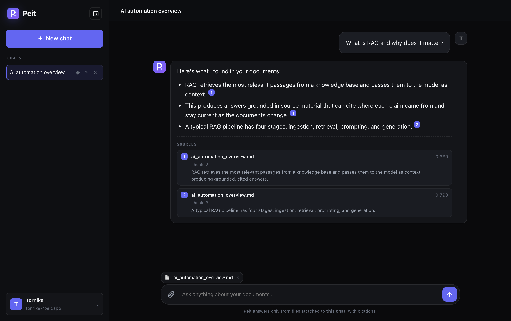
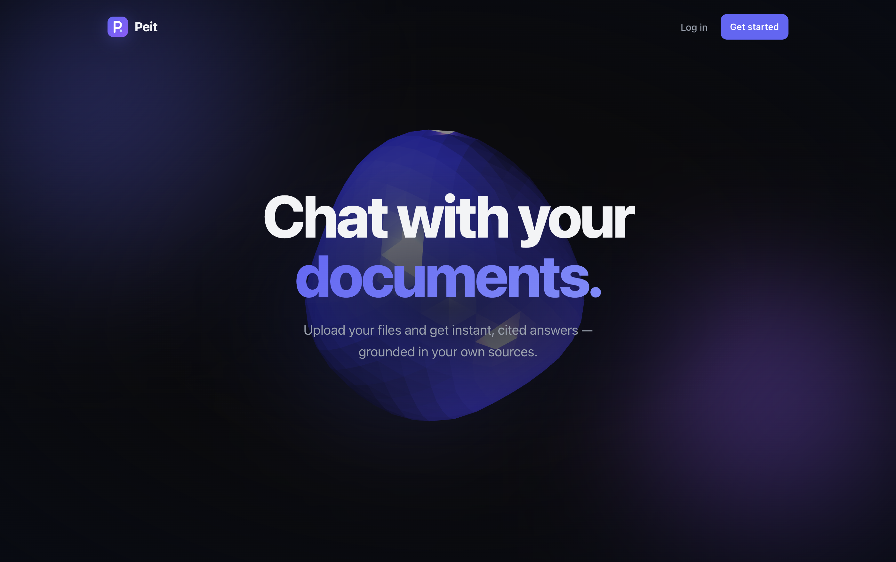
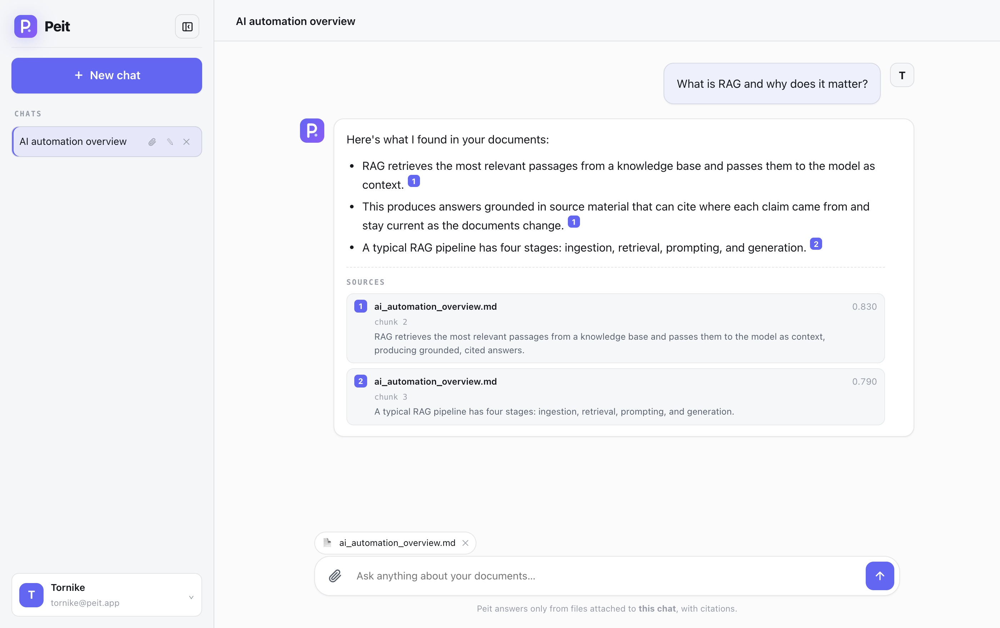
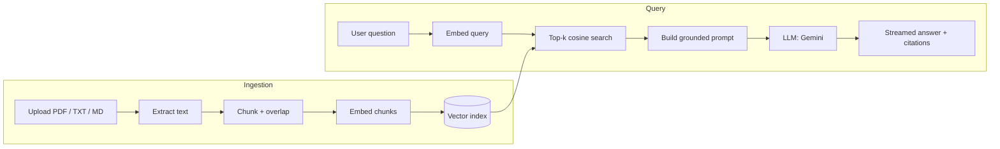

<div align="center">

# 📘 Peit — RAG Knowledge Assistant

**Chat with your documents — get grounded, cited answers.**

A production-shaped Retrieval-Augmented Generation (RAG) product: a full SaaS-style web app
(landing page, sign-up/login, dashboard with saved conversation history) on top of a FastAPI
RAG backend. Upload PDFs, text, or Markdown and query them in natural language — every answer
is generated **only** from the retrieved passages and cites its sources inline.

**▶ [Live demo](https://rag-knowledge-assistant-blue.vercel.app)** · deployed on Vercel

[](https://rag-knowledge-assistant-blue.vercel.app)
[](https://github.com/tornikepe/rag-knowledge-assistant/actions/workflows/ci.yml)


<br />



</div>

---

> **Runs in 60 seconds with zero API keys.** The project ships with an offline mode
> (deterministic embeddings + an extractive answerer) so you can clone, run, and see the
> full pipeline work immediately — then add **one free [Gemini](https://aistudio.google.com/apikey)
> key** to switch to real semantic retrieval and generation, at no cost.

## ✨ Features

- **Document ingestion** — PDF, TXT, and Markdown, with smart overlapping chunking.
- **Semantic retrieval** — cosine-similarity search over a persisted vector index.
- **Grounded answers with citations** — the model answers only from retrieved context and
  marks every claim with `[n]` source markers.
- **Token streaming** — answers stream to the UI over Server-Sent Events.
- **Pluggable providers** — swap embeddings (Gemini / OpenAI ↔ offline) and the LLM
  (Gemini / Claude ↔ offline) behind clean interfaces; the vector store is equally
  swappable (Chroma / pgvector / Pinecone).
- **Full product UI ("Peit")** — a from-scratch, framework-free single-page app: animated
  marketing landing page, sign-up with **email verification codes** (+ **password reset**),
  Google/GitHub OAuth, and a dashboard with saved conversation history, **per-chat document
  uploads**, chat rename, a collapsible sidebar, a profile menu (manage account + settings),
  light + dark theme, and a fully responsive/mobile layout. *(Password auth and history are
  client-side — see the note below — so the live demo needs no database; email verification
  and OAuth are real backend flows.)*
- **Per-chat retrieval** — documents are uploaded into a specific conversation and answers
  are grounded only in that chat's files (the vector store is partitioned by collection).
- **Fully tested & CI-ready** — the whole pipeline is exercised offline; `pytest` passes
  with no keys and no network.

> **Note on auth & history.** To keep the public demo zero-backend, sign-up/login and chat
> history are implemented client-side (localStorage). The RAG endpoints (`/api/*`) are the
> real backend. For production, swap in a real auth provider (e.g. Clerk/Auth.js) and a
> database (e.g. Postgres/Neon) — the frontend is structured so this is a drop-in change.

## 🖼️ Screenshots

<div align="center">
  
  &nbsp;
  
  <br />
  <em>Animated landing page · the dashboard in light and dark themes.</em>
</div>

## 🏗️ Architecture



**Retrieval pipeline:** `ingest → chunk → embed → index` then `embed query → retrieve
top-k → prompt with numbered context → generate with [n] citations`.

## 🚀 Quickstart

### Option A — local (offline, no keys)

```bash
git clone https://github.com/tornikepe/rag-knowledge-assistant.git
cd rag-knowledge-assistant

python -m venv .venv && source .venv/bin/activate   # Windows: .venv\Scripts\activate
pip install -r requirements.txt

python scripts/ingest_sample.py       # optional: seed the bundled sample doc
uvicorn app.main:app --reload         # → http://localhost:8000
```

Open **http://localhost:8000**, upload a document, and start asking questions.

### Option B — Docker

```bash
docker compose up --build             # → http://localhost:8000
```

### Option C — Deploy to Vercel (one click)

The repo ships a `vercel.json` + serverless entry point (`api/index.py`). Import the
repo on Vercel and it deploys as-is — the live demo runs in offline mode (no keys) and
auto-seeds the sample document so it's queryable immediately.

[](https://vercel.com/new/clone?repository-url=https://github.com/tornikepe/rag-knowledge-assistant)

> On serverless the vector index lives in `/tmp` (ephemeral), so uploads persist only
> within a warm instance — perfect for a demo. For durable storage, run it as a container
> or swap in a hosted vector DB behind the `VectorStore` interface.

### Enable real models — free with Gemini (recommended)

Gemini's free tier runs the whole pipeline at no cost, and **one key powers both the
LLM and the embeddings**. Grab a free key at
**[Google AI Studio](https://aistudio.google.com/apikey)**, copy `.env.example` to
`.env`, and set:

```ini
EMBEDDING_PROVIDER=gemini
LLM_PROVIDER=gemini
GEMINI_API_KEY=...
```

That's it — real semantic retrieval **and** grounded, cited generation, for free.
`GEMINI_MODEL` defaults to `gemini-flash-latest` (always the current free Flash model).

Prefer other providers? The interfaces are pluggable: set `LLM_PROVIDER=anthropic`
(+ `ANTHROPIC_API_KEY`) for Claude, or `EMBEDDING_PROVIDER=openai` (+ `OPENAI_API_KEY`)
for OpenAI embeddings — install the optional SDK first with `pip install anthropic`
or `pip install openai`.

> **On Vercel** (or any host), set these as **Environment Variables** in the project
> settings instead of a `.env` file, then redeploy — env-var changes only take effect
> on the next deployment. The same applies to the OAuth and SMTP variables below.

## ⚙️ Configuration

| Variable                 | Default                | Description                                                   |
| ------------------------ | ---------------------- | ------------------------------------------------------------ |
| `EMBEDDING_PROVIDER`     | `hash`                 | `hash` (offline), `gemini` (free), or `openai`               |
| `LLM_PROVIDER`           | `echo`                 | `echo` (offline), `gemini` (free), or `anthropic`            |
| `GEMINI_API_KEY`         | —                      | One free key for the `gemini` LLM **and** embeddings ([get one](https://aistudio.google.com/apikey)) |
| `GEMINI_MODEL`           | `gemini-flash-latest`  | Gemini model for generation                                  |
| `GEMINI_EMBEDDING_MODEL` | `gemini-embedding-001` | Gemini embedding model                                       |
| `GEMINI_EMBEDDING_DIM`   | `768`                  | Gemini embedding output dimensionality                       |
| `GEMINI_THINKING_BUDGET` | `0`                    | `0` disables thinking (fast/cheap); `-1` lets the model decide |
| `ANTHROPIC_API_KEY`      | —                      | Required when `LLM_PROVIDER=anthropic`                        |
| `ANTHROPIC_MODEL`        | `claude-opus-4-8`      | Claude model for generation                                  |
| `OPENAI_API_KEY`         | —                      | Required when `EMBEDDING_PROVIDER=openai`                     |
| `EMBEDDING_MODEL`        | `text-embedding-3-small` | OpenAI embedding model                                     |
| `CHUNK_SIZE`             | `900`                  | Target characters per chunk                                  |
| `CHUNK_OVERLAP`          | `150`                  | Overlap between adjacent chunks                              |
| `TOP_K`                  | `4`                    | Chunks retrieved per query                                   |
| `STORAGE_DIR`            | `storage`              | Where the vector index is persisted                          |

## 🔐 Real Google / GitHub OAuth (optional)

The login popup's **Continue with Google / GitHub** buttons use real OAuth 2.0 when
configured, and fall back to a demo login otherwise — so the app works out of the box and
"upgrades" the moment you add credentials. The backend (`app/api/auth.py`) runs the
Authorization Code flow and issues a signed session cookie; nothing extra is needed on the
client.

To enable it:

1. **Create the OAuth apps** and copy each client id + secret:
   - **Google** — [Google Cloud Console](https://console.cloud.google.com/apis/credentials) →
     *Create Credentials → OAuth client ID → Web application*.
   - **GitHub** — [Developer settings → OAuth Apps](https://github.com/settings/developers) →
     *New OAuth App*.
2. **Set the redirect (callback) URLs** to your deployment, exactly:
   - `https://<your-app>.vercel.app/api/auth/google/callback`
   - `https://<your-app>.vercel.app/api/auth/github/callback`
3. **Set the environment variables** (locally in `.env`, or in the Vercel project settings):
   ```ini
   SESSION_SECRET=<a long random string>
   OAUTH_REDIRECT_BASE=https://<your-app>.vercel.app
   GOOGLE_CLIENT_ID=...
   GOOGLE_CLIENT_SECRET=...
   GITHUB_CLIENT_ID=...
   GITHUB_CLIENT_SECRET=...
   ```

`GET /api/auth/providers` reports which providers are live. Auth routes: `/api/auth/{provider}/login`,
`/api/auth/{provider}/callback`, `/api/auth/me`, `/api/auth/logout`.

> The vector index is partitioned by **collection** (one per chat) behind the `VectorStore`
> interface, so uploads only affect the conversation they were added to. Extending the same
> mechanism to per-user scoping is a small change.

## 📧 Email sign-up verification (optional SMTP)

Sign-up emails a **6-digit code** to the address being registered, and the same flow powers
**"Forgot password?"** on the login screen. Configure SMTP to turn it on; without it, email
sign-up and reset are disabled and users sign in with Google/GitHub instead.

Set these (in `.env` locally, or the Vercel project settings — then redeploy):

```ini
SMTP_HOST=smtp.gmail.com
SMTP_PORT=587
SMTP_USER=you@gmail.com          # the full address that sends the mail (required)
SMTP_PASSWORD=your-app-password  # see the Gmail note below
SMTP_FROM=you@gmail.com          # optional; defaults to SMTP_USER
SMTP_STARTTLS=true
```

> **Gmail:** use an **App Password**, not your account password. Turn on 2-Step Verification,
> create one at [myaccount.google.com/apppasswords](https://myaccount.google.com/apppasswords),
> and paste the 16 characters **without spaces**. All three of `SMTP_HOST`, `SMTP_USER`, and
> `SMTP_PASSWORD` must be set. (Vercel's serverless functions *can* send over SMTP — the port
> isn't blocked.)

The code is carried in a short-lived HMAC-signed token, so no database is needed. Endpoints:
`POST /api/auth/signup/start`, `POST /api/auth/signup/verify`.

## 🔌 API

Interactive OpenAPI docs are served at **`/docs`**.

| Method   | Endpoint             | Description                                    |
| -------- | -------------------- | ---------------------------------------------- |
| `GET`    | `/api/health`        | Status, providers, and index size              |
| `POST`   | `/api/ingest`        | Upload & index a document (multipart; optional `collection`) |
| `POST`   | `/api/query`         | Ask a question → answer + citations (JSON; optional `collection`) |
| `POST`   | `/api/query/stream`  | Same, streamed as Server-Sent Events           |
| `GET`    | `/api/documents`     | List indexed documents (optional `?collection=`) |
| `DELETE` | `/api/documents`     | Clear the index                                |

```bash
# Ingest, then ask:
curl -F "file=@data/sample_docs/ai_automation_overview.md" http://localhost:8000/api/ingest
curl -s http://localhost:8000/api/query \
  -H "Content-Type: application/json" \
  -d '{"question": "What is RAG and why does it matter?"}' | jq
```

## 🧪 Tests

```bash
pytest            # offline: no API keys, no network
```

Covers chunking, the vector store (ranking + persistence), and the full API flow
(ingest → query → stream → clear) via FastAPI's `TestClient`.

## 📂 Project structure

```
rag-knowledge-assistant/
├── app/
│   ├── main.py            # FastAPI app + static UI mount
│   ├── config.py          # Settings (pydantic-settings)
│   ├── schemas.py         # API request/response models
│   ├── api/routes.py      # HTTP endpoints
│   └── core/
│       ├── chunking.py    # Overlapping text splitter
│       ├── embeddings.py  # Gemini + OpenAI + offline hashing providers
│       ├── vectorstore.py # From-scratch NumPy cosine index (persisted)
│       ├── ingest.py      # PDF / text extraction
│       ├── llm.py         # Gemini + Claude + offline echo providers
│       └── service.py     # RAG orchestration (retrieve → prompt → generate)
├── frontend/              # Dependency-free chat UI (HTML/CSS/JS)
├── tests/                 # Offline pytest suite
├── data/sample_docs/      # A sample document to try immediately
├── scripts/ingest_sample.py
├── Dockerfile · docker-compose.yml · Makefile
└── .github/workflows/ci.yml
```

## 🧠 Design notes

- **Why a hand-written vector store?** Retrieval is just normalized dot products over a
  matrix — implementing it directly makes the mechanics legible and keeps the dependency
  footprint tiny. It sits behind a `VectorStore` interface, so moving to Chroma, pgvector,
  or Pinecone is a one-class change.
- **Why offline providers?** So the repo is genuinely runnable and CI-testable without
  secrets. The provider abstraction is the same one used for the real Gemini/OpenAI/Claude
  implementations — nothing is faked at the seams.
- **Grounding & citations.** Retrieved chunks are numbered in the prompt and the model is
  instructed to answer only from them and cite with `[n]`; the API returns the matching
  source list so the UI can render verifiable sources.

## 🗺️ Roadmap

- [ ] Hybrid search (BM25 + dense) and re-ranking
- [x] Per-collection indexes (per-chat document scoping)
- [ ] Per-user multi-tenant indexes + durable storage
- [ ] Streaming citation highlights in the UI
- [ ] Pluggable Chroma / pgvector backends behind the existing interface

## 📄 License

MIT — see [LICENSE](LICENSE).

---

<div align="center">
Built by <strong>Tornike Petriashvili</strong> · Part of an AI Automation portfolio.
</div>
