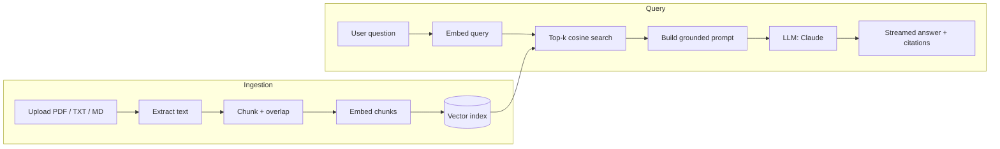

<div align="center">

# 📚 RAG Knowledge Assistant

**Ask your documents anything — get grounded, cited answers.**

A production-shaped Retrieval-Augmented Generation (RAG) service: upload PDFs, text, or
Markdown, and query them in natural language. Every answer is generated **only** from the
retrieved passages and cites its sources inline.

**▶ [Live demo](https://rag-knowledge-assistant.vercel.app)** · deployed on Vercel

[](https://rag-knowledge-assistant.vercel.app)
[](https://github.com/tornikepe/rag-knowledge-assistant/actions/workflows/ci.yml)


</div>

---

> **Runs in 60 seconds with zero API keys.** The project ships with an offline mode
> (deterministic embeddings + an extractive answerer) so you can clone, run, and see the
> full pipeline work immediately — then flip two env vars to switch to OpenAI embeddings
> and Claude for real semantic retrieval and generation.

## ✨ Features

- **Document ingestion** — PDF, TXT, and Markdown, with smart overlapping chunking.
- **Semantic retrieval** — cosine-similarity search over a persisted vector index.
- **Grounded answers with citations** — the model answers only from retrieved context and
  marks every claim with `[n]` source markers.
- **Token streaming** — answers stream to the UI over Server-Sent Events.
- **Pluggable providers** — swap embeddings (OpenAI ↔ offline) and the LLM (Claude ↔
  offline) behind clean interfaces; the vector store is equally swappable (Chroma /
  pgvector / Pinecone).
- **Clean chat UI** — dependency-free single-page front end, light + dark theme.
- **Fully tested & CI-ready** — the whole pipeline is exercised offline; `pytest` passes
  with no keys and no network.

## 🖼️ Demo

<!-- Record a short clip (upload a doc → ask a question → see the cited streamed answer)
     and drop it in as docs/demo.gif, then this image will render on the repo home page. -->
<div align="center">
  
  <br /><em>Upload a document, ask a question, get a streamed answer with sources.</em>
</div>

## 🏗️ Architecture



**Retrieval pipeline:** `ingest → chunk → embed → index` then `embed query → retrieve
top-k → prompt with numbered context → generate with [n] citations`.

## 🚀 Quickstart

### Option A — local (offline, no keys)

```bash
git clone https://github.com/tornikepe/rag-knowledge-assistant.git
cd rag-knowledge-assistant

python -m venv .venv && source .venv/bin/activate   # Windows: .venv\Scripts\activate
pip install -r requirements.txt

python scripts/ingest_sample.py       # optional: seed the bundled sample doc
uvicorn app.main:app --reload         # → http://localhost:8000
```

Open **http://localhost:8000**, upload a document, and start asking questions.

### Option B — Docker

```bash
docker compose up --build             # → http://localhost:8000
```

### Option C — Deploy to Vercel (one click)

The repo ships a `vercel.json` + serverless entry point (`api/index.py`). Import the
repo on Vercel and it deploys as-is — the live demo runs in offline mode (no keys) and
auto-seeds the sample document so it's queryable immediately.

[](https://vercel.com/new/clone?repository-url=https://github.com/tornikepe/rag-knowledge-assistant)

> On serverless the vector index lives in `/tmp` (ephemeral), so uploads persist only
> within a warm instance — perfect for a demo. For durable storage, run it as a container
> or swap in a hosted vector DB behind the `VectorStore` interface.

### Enable real models (recommended)

Copy `.env.example` to `.env` and set:

```ini
EMBEDDING_PROVIDER=openai
OPENAI_API_KEY=sk-...

LLM_PROVIDER=anthropic
ANTHROPIC_API_KEY=sk-ant-...
ANTHROPIC_MODEL=claude-opus-4-8
```

## ⚙️ Configuration

| Variable             | Default              | Description                                            |
| -------------------- | -------------------- | ------------------------------------------------------ |
| `EMBEDDING_PROVIDER` | `hash`               | `hash` (offline) or `openai`                           |
| `EMBEDDING_MODEL`    | `text-embedding-3-small` | OpenAI embedding model                             |
| `OPENAI_API_KEY`     | —                    | Required when `EMBEDDING_PROVIDER=openai`               |
| `LLM_PROVIDER`       | `echo`               | `echo` (offline) or `anthropic`                        |
| `ANTHROPIC_MODEL`    | `claude-opus-4-8`    | Claude model for generation                            |
| `ANTHROPIC_API_KEY`  | —                    | Required when `LLM_PROVIDER=anthropic`                  |
| `CHUNK_SIZE`         | `900`                | Target characters per chunk                            |
| `CHUNK_OVERLAP`      | `150`                | Overlap between adjacent chunks                         |
| `TOP_K`              | `4`                  | Chunks retrieved per query                              |
| `STORAGE_DIR`        | `storage`            | Where the vector index is persisted                    |

## 🔌 API

Interactive OpenAPI docs are served at **`/docs`**.

| Method   | Endpoint             | Description                                    |
| -------- | -------------------- | ---------------------------------------------- |
| `GET`    | `/api/health`        | Status, providers, and index size              |
| `POST`   | `/api/ingest`        | Upload & index a document (multipart)          |
| `POST`   | `/api/query`         | Ask a question → answer + citations (JSON)     |
| `POST`   | `/api/query/stream`  | Same, streamed as Server-Sent Events           |
| `GET`    | `/api/documents`     | List indexed documents                         |
| `DELETE` | `/api/documents`     | Clear the index                                |

```bash
# Ingest, then ask:
curl -F "file=@data/sample_docs/ai_automation_overview.md" http://localhost:8000/api/ingest
curl -s http://localhost:8000/api/query \
  -H "Content-Type: application/json" \
  -d '{"question": "What is RAG and why does it matter?"}' | jq
```

## 🧪 Tests

```bash
pytest            # offline: no API keys, no network
```

Covers chunking, the vector store (ranking + persistence), and the full API flow
(ingest → query → stream → clear) via FastAPI's `TestClient`.

## 📂 Project structure

```
rag-knowledge-assistant/
├── app/
│   ├── main.py            # FastAPI app + static UI mount
│   ├── config.py          # Settings (pydantic-settings)
│   ├── schemas.py         # API request/response models
│   ├── api/routes.py      # HTTP endpoints
│   └── core/
│       ├── chunking.py    # Overlapping text splitter
│       ├── embeddings.py  # OpenAI + offline hashing providers
│       ├── vectorstore.py # From-scratch NumPy cosine index (persisted)
│       ├── ingest.py      # PDF / text extraction
│       ├── llm.py         # Claude + offline echo providers
│       └── service.py     # RAG orchestration (retrieve → prompt → generate)
├── frontend/              # Dependency-free chat UI (HTML/CSS/JS)
├── tests/                 # Offline pytest suite
├── data/sample_docs/      # A sample document to try immediately
├── scripts/ingest_sample.py
├── Dockerfile · docker-compose.yml · Makefile
└── .github/workflows/ci.yml
```

## 🧠 Design notes

- **Why a hand-written vector store?** Retrieval is just normalized dot products over a
  matrix — implementing it directly makes the mechanics legible and keeps the dependency
  footprint tiny. It sits behind a `VectorStore` interface, so moving to Chroma, pgvector,
  or Pinecone is a one-class change.
- **Why offline providers?** So the repo is genuinely runnable and CI-testable without
  secrets. The provider abstraction is the same one used for the real OpenAI/Claude
  implementations — nothing is faked at the seams.
- **Grounding & citations.** Retrieved chunks are numbered in the prompt and the model is
  instructed to answer only from them and cite with `[n]`; the API returns the matching
  source list so the UI can render verifiable sources.

## 🗺️ Roadmap

- [ ] Hybrid search (BM25 + dense) and re-ranking
- [ ] Per-collection / multi-tenant indexes
- [ ] Streaming citation highlights in the UI
- [ ] Pluggable Chroma / pgvector backends behind the existing interface

## 📄 License

MIT — see [LICENSE](LICENSE).

---

<div align="center">
Built by <strong>Tornike Petriashvili</strong> · Part of an AI Automation portfolio.
</div>
